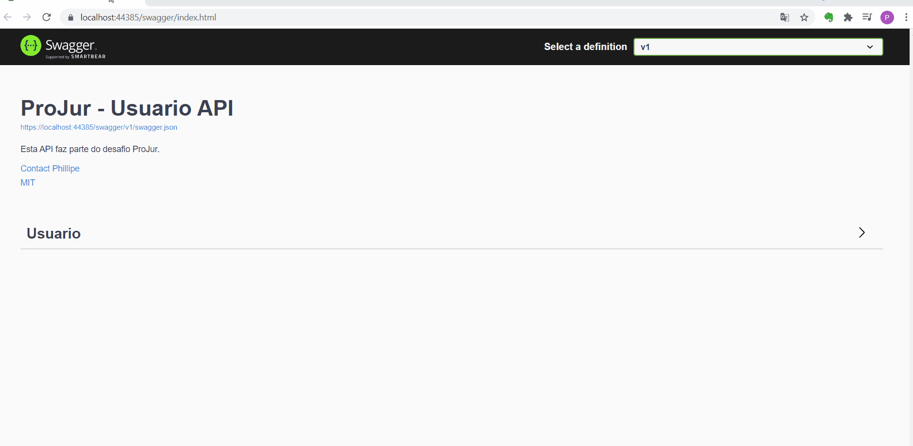

# ProJur - Desafio


## Back-end

### Arquitetura
Foi implementado conceitos DDD, SOLID, Clean Code, POO e o padrão arquitetural CQRS 

### Tecnologias e bibliotecas

- ORM EF com migrations
- MSSQL
- FluentValidation
- AutoMapper
- Swagger 
- MediaTr

### Padrões

- Repository
- UoW
- Mediator
- Generic


### Resultado



### Executar
Antes de rodar o back e o front, execute o migrations para criar a estrtutura do banco de dados

 >``` dotnet ef  migrations add Inicio --project "src\services\ProJur.Cadastros.Infra\ProJur.Cadastros.Infra.csproj" --startup-project ".\src\services\ProJur.Cadastros.API" ```
 
 >``` dotnet ef database update --project "src\services\ProJur.Cadastros.Infra\ProJur.Cadastros.Infra.csproj" --startup-project ".\src\services\ProJur.Cadastros.API" ```
 
 Obs: Necessário configurar uma conexão caso não tenha SQL Express instalado

## Front-end

Portal feito em angular ~11.0.3

### Bibliotecas

- @angular/material
- font-awesome
- @ngx-loading-bar
- ngx-toastr 

### Layout

Utilização de componentes material ui

### Resultado
